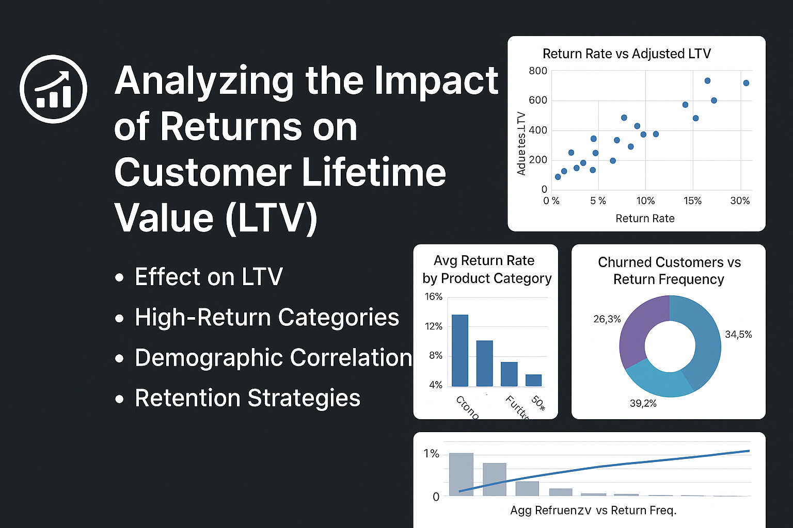

---

# 📊 Analyzing the Impact of Returns on Customer Lifetime Value (LTV)

Welcome to the official repository for the **Customer LTV Analytics Project**, a comprehensive SQL and Power BI-based analysis that explores how product returns impact Customer Lifetime Value (LTV). This project dives into six core business objectives using advanced SQL queries, structured business logic, and visual storytelling via Power BI.

---

## 🧰 Tools & Technologies

- **SQL**: Core language used for data cleaning, transformation, cohort creation, and deriving metrics.
- **Power BI**: Used to design professional, dynamic dashboards and visualizations aligned with each objective.
- **Python**: Used only for downloading the dataset from Kaggle using the Kaggle API.

---

## 🗃️ Dataset

The project uses a Kaggle dataset simulating retail customer behavior [here](https://www.kaggle.com/datasets/shriyashjagtap/e-commerce-customer-for-behavior-analysis). Key tables include:
- `Customer_ID`, `Purchase_Date`, `Product_Category`, `Payment_Method`, `Purchase_Amount`, `Returns`, `Gender`, `Age`

Derived fields include:
- `Adjusted_LTV`, `Return_Rate`, `Churned`, `Customer_Segment`, `ReturnCohort`, and more.

---

## 🎯 Project Objectives & SQL

Each objective includes a core question, SQL logic, and a link to the interactive Power BI dashboard.

---

### 1️⃣ How do returns affect total Customer Lifetime Value (LTV)?

**SQL Snippet:**
```sql
SELECT 
    Customer_ID,
    SUM(Total_Purchase_Amount) AS Total_Revenue,
    SUM(CASE WHEN Returns = 1 THEN Total_Purchase_Amount ELSE 0 END) AS Total_Returns,
    SUM(Total_Purchase_Amount) - 
    SUM(CASE WHEN Returns = 1 THEN Total_Purchase_Amount ELSE 0 END) AS Adjusted_LTV,
    -- Cast the numerator (Total_Returns) to FLOAT to avoid integer division
    Round(
		(CAST(SUM(CASE WHEN Returns = 1 THEN Total_Purchase_Amount ELSE 0 END) AS FLOAT) / 
		SUM(Total_Purchase_Amount)) * 100, 2
	) AS Return_Rate_Percentage
FROM CustBehavior
GROUP BY Customer_ID;
```

🔗 [View Power BI Dashboard](https://app.powerbi.com/view?r=eyJrIjoiNjQ1MTQ4YzYtMzAyOC00NTc2LTg5Y2YtZDA0OWE0YTMyZjIxIiwidCI6ImQ2YzI2MTkwLTNlY2MtNDgxYi05ZjRmLTZiZDk3NGI3YTUxMSIsImMiOjJ9)

---

### 2️⃣ Which product categories have the highest return rates and how do they impact revenue and LTV?

**SQL Snippet:**
```sql
SELECT 
    Product_Category,
    COUNT(*) AS Total_Orders,
    SUM(Total_Purchase_Amount) AS Total_Revenue,
    SUM(CASE WHEN Returns = 1 THEN Total_Purchase_Amount ELSE 0 END) AS Total_Returns,
    SUM(Total_Purchase_Amount) - SUM(CASE WHEN Returns = 1 THEN Total_Purchase_Amount ELSE 0 END) AS Adjusted_Revenue,
    ROUND(
        (CAST(SUM(CASE WHEN Returns = 1 THEN Total_Purchase_Amount ELSE 0 END) AS FLOAT) / 
        SUM(Total_Purchase_Amount)) * 100, 2
    ) AS Return_Rate_Percentage,
    ROUND(
        (SUM(Total_Purchase_Amount) - SUM(CASE WHEN Returns = 1 THEN Total_Purchase_Amount ELSE 0 END)) / 
        COUNT(DISTINCT Customer_ID), 0
    ) AS Avg_Adjusted_LTV_Per_Customer
FROM CustBehavior
GROUP BY Product_Category
ORDER BY Return_Rate_Percentage DESC;
```

🔗 [View Power BI Dashboard](https://app.powerbi.com/view?r=eyJrIjoiNGE2ZGE0OTgtYzRkNy00MzRhLWEwZjctYmUwZTMzNmU2ZTRjIiwidCI6ImQ2YzI2MTkwLTNlY2MtNDgxYi05ZjRmLTZiZDk3NGI3YTUxMSIsImMiOjJ9)

---

### 3️⃣ Are specific customer demographics (age, gender) associated with higher return rates and lower LTV?

**SQL Snippet:**
```sql
-- Step 1: Add Age_Group column if not already added
ALTER TABLE CustBehavior
ADD Age_Group VARCHAR(10)

-- Step 2: Update Age_Group values
UPDATE CustBehavior
SET Age_Group = 
	CASE
		WHEN Age BETWEEN 0 AND 24 THEN '18-24'
		WHEN Age BETWEEN 25 AND 34 THEN '25-34'
		WHEN Age BETWEEN 35 AND 44 THEN '35-44'
		WHEN Age BETWEEN 45 AND 54 THEN '45-54'
		WHEN Age BETWEEN 55 AND 64 THEN '55-64'
		ELSE '65+'
	END;


-- Step 3: Add Age_Category column if not already added
ALTER TABLE CustBehavior
ADD Age_Category VARCHAR(20);

-- Step 4: Update Age_Category values
UPDATE CustBehavior
SET Age_Category = 
    CASE 
        WHEN Age BETWEEN 18 AND 24 THEN 'Young Adults'
        WHEN Age BETWEEN 25 AND 34 THEN 'Early Career'
        WHEN Age BETWEEN 35 AND 44 THEN 'Mid Career'
        WHEN Age BETWEEN 45 AND 54 THEN 'Experienced'
        WHEN Age >= 55 THEN 'Senior'
        ELSE 'Unknown'
    END;


-- Step 5: Final Aggregation Query
SELECT 
	Gender,
	Age_Group,
	Age_Category,
	COUNT(DISTINCT Customer_ID) AS Customer_Count,
	COUNT(CASE WHEN Returns = 1 THEN 1 END) AS Return_Transactions,
	SUM(Total_Purchase_Amount) AS Total_Revenue,
	SUM(CASE WHEN Returns = 1 THEN Total_Purchase_Amount ELSE 0 END) AS Total_Retruns,
	SUM(Total_Purchase_Amount) - SUM(CASE WHEN Returns = 1 THEN Total_Purchase_Amount ELSE 0 END) AS Adjusted_LTV,

	-- Return Rate
	ROUND(
		(CAST(SUM(CASE WHEN Returns = 1 THEN Total_Purchase_Amount ELSE 0 END) AS FLOAT) / 
		 NULLIF(SUM(Total_Purchase_Amount), 0)) * 100, 2
	) AS Return_Rate_Percentage,


	-- Average Adjusted LTV per Customer
	ROUND(
		(SUM(Total_Purchase_Amount) - SUM(CASE WHEN Returns = 1 THEN Total_Purchase_Amount ELSE 0 END)) /
		NULLIF(COUNT(DISTINCT Customer_ID), 0), 2
	) AS Avg_Adjusted_LTV_Per_Customer,


	-- Retrun Frequency per Customer
	CAST(
		ROUND(
			COUNT(CASE WHEN Returns = 1 THEN 1 END) * 1.0 / NULLIF(COUNT(DISTINCT Customer_ID), 0), 2
		) AS DECIMAL(10,2)
	) AS Return_Frequency_Per_Customer,


	-- LTV-to-Return Ratio
	ROUND(
		(CAST(SUM(Total_Purchase_Amount) - SUM(CASE WHEN Returns = 1 THEN Total_Purchase_Amount ELSE 0 END) AS FLOAT)) /
		NULLIF(SUM(CASE WHEN Returns = 1 THEN Total_Purchase_Amount ELSE 0 END), 0), 2
	) AS LTV_to_Return_Ratio

FROM CustBehavior
GROUP BY Gender, Age_Group, Age_Category
ORDER BY Age_Group, Gender;
```

🔗 [View Power BI Dashboard](https://app.powerbi.com/view?r=eyJrIjoiMTM2MjkzZTUtMmJhYS00YTA1LWJkZjAtZTNjNmViYmJlYWM0IiwidCI6ImQ2YzI2MTkwLTNlY2MtNDgxYi05ZjRmLTZiZDk3NGI3YTUxMSIsImMiOjJ9)

---

### 4️⃣ Is there a correlation between return frequency and customer churn?

**SQL Snippet:**
```sql
-- Step 1: Customer-level return behavior and value
WITH CustomerSummary AS (
    SELECT 
        Customer_ID,
        Churn,
        COUNT(*) AS Total_Transactions,
        SUM(Total_Purchase_Amount) AS Total_Revenue,
        SUM(CASE WHEN Returns = 1 THEN Total_Purchase_Amount ELSE 0 END) AS Total_Returns,
        SUM(Total_Purchase_Amount) - SUM(CASE WHEN Returns = 1 THEN Total_Purchase_Amount ELSE 0 END) AS Adjusted_LTV,
        ROUND(
            (CAST(SUM(CASE WHEN Returns = 1 THEN Total_Purchase_Amount ELSE 0 END) AS FLOAT) / 
            NULLIF(SUM(Total_Purchase_Amount), 0)) * 100, 2
        ) AS Return_Rate
    FROM CustBehavior
    GROUP BY Customer_ID, Churn
),
-- Step 2: Aggregate per churn segment
SegmentSummary AS (
    SELECT 
        Churn,
        COUNT(*) AS Customer_Count,
        ROUND(AVG(Total_Transactions), 2) AS Avg_Transactions,
        ROUND(AVG(Return_Rate), 2) AS Avg_Return_Rate,
        ROUND(AVG(Adjusted_LTV), 2) AS Avg_Adjusted_LTV,
        ROUND(SUM(Adjusted_LTV) / NULLIF(COUNT(*), 0), 2) AS Avg_Adjusted_LTV_Per_Customer,
        SUM(Total_Revenue) AS Total_Revenue,
        SUM(Total_Returns) AS Total_Returns,
        SUM(Adjusted_LTV) AS Total_Adjusted_LTV
    FROM CustomerSummary
    GROUP BY Churn
),
-- Step 3: Add return-to-churn ratio and churn rate to each row
Final AS (
    SELECT 
        ss.*,
        -- Get Return-to-Churn metrics using scalar subqueries
        (SELECT ROUND(AVG(Return_Rate), 2) FROM CustomerSummary WHERE Churn = 1) AS Avg_Return_Rate_Churned,
        (SELECT ROUND(AVG(Return_Rate), 2) FROM CustomerSummary WHERE Churn = 0) AS Avg_Return_Rate_Retained,
        (SELECT ROUND(
            (SELECT AVG(Return_Rate) FROM CustomerSummary WHERE Churn = 1) / 
            NULLIF((SELECT AVG(Return_Rate) FROM CustomerSummary WHERE Churn = 0), 0), 2)
        ) AS Return_to_Churn_Ratio,
        -- Add churn rate (same for all rows)
        (SELECT ROUND(
            CAST(COUNT(DISTINCT CASE WHEN Churn = 1 THEN Customer_ID END) AS FLOAT) /
            COUNT(DISTINCT Customer_ID) * 100, 2
         ) FROM CustBehavior) AS Churn_Rate_Percentage
    FROM SegmentSummary ss
)

-- Final output
SELECT * FROM Final ORDER BY Churn;
```

🔗 [View Power BI Dashboard](https://app.powerbi.com/view?r=eyJrIjoiYWU2Y2VkYzMtYjkzYy00Y2MzLTgzZTUtM2Q5ZDk3OWM2MDUxIiwidCI6ImQ2YzI2MTkwLTNlY2MtNDgxYi05ZjRmLTZiZDk3NGI3YTUxMSIsImMiOjJ9)

---

### 5️⃣ Do payment methods affect the likelihood of returns and their influence on LTV?

**SQL Snippet:**
```sql
SELECT 
    Payment_Method,
    COUNT(DISTINCT Customer_ID) AS Unique_Customers,
    COUNT(*) AS Total_Transactions,
    SUM(Total_Purchase_Amount) AS Total_Revenue,
    SUM(CASE WHEN Returns = 1 THEN Total_Purchase_Amount ELSE 0 END) AS Total_Returns,
    SUM(Total_Purchase_Amount) - SUM(CASE WHEN Returns = 1 THEN Total_Purchase_Amount ELSE 0 END) AS Adjusted_Revenue,
    
    -- Return Rate
    ROUND(
        (CAST(SUM(CASE WHEN Returns = 1 THEN Total_Purchase_Amount ELSE 0 END) AS FLOAT) / 
        NULLIF(SUM(Total_Purchase_Amount), 0)) * 100, 2
    ) AS Return_Rate_Percentage,

    -- Avg Adjusted LTV per Customer
    ROUND(
        (SUM(Total_Purchase_Amount) - SUM(CASE WHEN Returns = 1 THEN Total_Purchase_Amount ELSE 0 END)) /
        NULLIF(COUNT(DISTINCT Customer_ID), 0), 2
    ) AS Avg_Adjusted_LTV_Per_Customer

FROM CustBehavior
GROUP BY Payment_Method
ORDER BY Return_Rate_Percentage DESC;
```

🔗 [View Power BI Dashboard](https://app.powerbi.com/view?r=eyJrIjoiYzYxNjM2NGItNjllNy00ZDUzLWEwZWEtOGFhZmU4NmYwM2Y2IiwidCI6ImQ2YzI2MTkwLTNlY2MtNDgxYi05ZjRmLTZiZDk3NGI3YTUxMSIsImMiOjJ9)

---

## 📚 Published Articles

This project has been published as a **3-part Medium series**, each article covering two objectives:

| Part | Title | Link |
|------|-------|------|
| Part 1 | Analyzing the Impact of Returns on Customer Lifetime Value (LTV): A Comprehensive Data Analysis Guide | [Medium Article - Part 1](https://medium.com/@obiakarije/part-1-analyzing-the-impact-of-returns-on-customer-lifetime-value-ltv-a-comprehensive-data-08c0e275a16f) |
| Part 2 | Analyzing the Impact of Returns on Customer Lifetime Value (LTV): Fixing Missing Data. | [Medium Article - Part 2](https://medium.com/@obiakarije/part-2-analyzing-the-impact-of-returns-on-customer-lifetime-value-ltv-fixing-missing-data-524b3f45969d) |
| Part 3 | Analyzing the Impact of Returns on Customer Lifetime Value (LTV): Turning Data into Actionable Insights. | [Medium Article - Part 3](https://medium.com/@obiakarije/part-3-analyzing-the-impact-of-returns-on-customer-lifetime-value-ltv-turning-data-into-5f6c1cfb8d90) |


